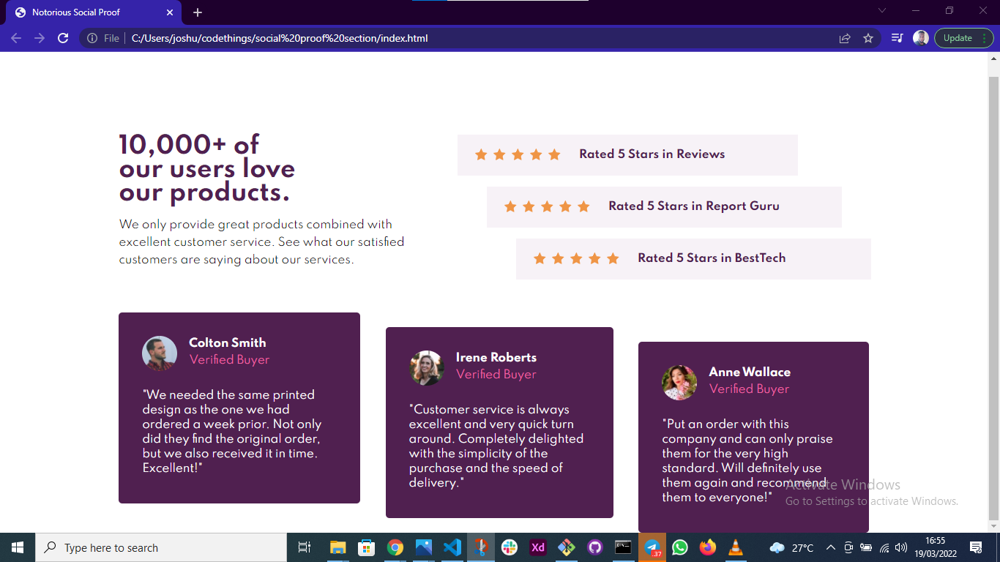

# Frontend Mentor - Social proof section solution

This is my solution to the Social proof section challenge on Frontend Mentor(https://www.frontendmentor.io/challenges/social-proof-section-6e0qTv_bA). 
## Table of contents

- [Overview](#overview)
  - [The challenge](#the-challenge)
  - [Screenshot](#screenshot)
  - [Links](#links)
- [My process](#my-process)
  - [Built with](#built-with)
  - [What I learned](#what-i-learned)
  - [Continued development](#continued-development)
  - [Useful resources](#useful-resources)
- [Author](#author)
- [Acknowledgments](#acknowledgments)

**Note: Delete this note and update the table of contents based on what sections you keep.**

## Overview

### The challenge

Users should be able to:

- View the optimal layout for the section depending on their device's screen size

### Screenshot

### Links

- Solution URL: [Add solution URL here](https://your-solution-url.com)
- Live Site URL: [Add live site URL here](https://your-live-site-url.com)

## My process

### Built with

- Semantic HTML5 markup
- SCSS
- Flexbox

### What I learned

This is the first time I'm actually using SCSS in a project so I'd say my learnings included:
* Figuring out how to organize my stylesheets
* Using SCSS @import and learning how it works
* Nesting in SCSS
* @mixins 
* Implementing media queries in SCSS

### Continued development

I plan to continue to use SCSS in my projects moving forward to master that language and get extremely comfortable using it. 

**Note: Delete this note and the content within this section and replace with your own plans for continued development.**

### Useful resources

- [Kinsta](https://kinsta.com/blog/responsive-web-design/) - This helped me with my media queries in particular. I needed to have an idea of what particular breakpoints I should use and this helped.

## Author

- Website - Tomi Joshua (www.behance.net/tomijodesigns)
- Frontend Mentor - [@notorioustomijo](https://www.frontendmentor.io/profile/yourusername)
- Twitter - [@notorioustomijo](https://www.twitter.com/notorioustomijo)

